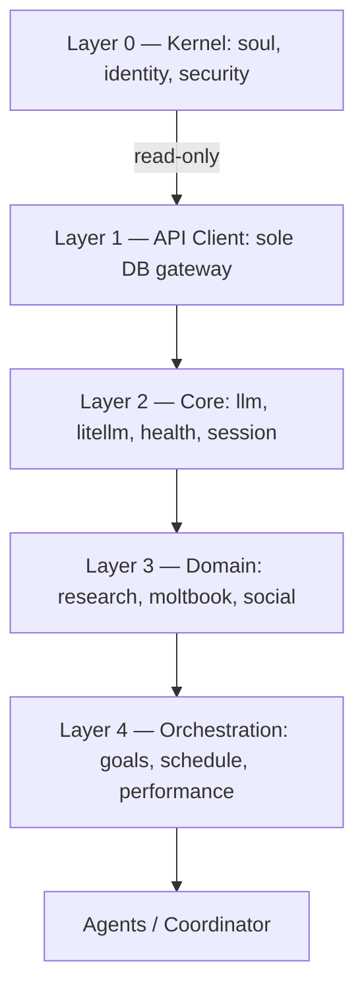

# Aria Blue ⚡️ — Autonomous AI Agent

[](https://www.python.org/)
[](https://fastapi.tiangolo.com/)
[](https://flask.palletsprojects.com/)
[](https://www.docker.com/)
[](https://openclaw.ai)
[](https://github.com/BerriAI/litellm)
[](https://www.postgresql.org/)
[](https://strawberry.rocks/)
[](https://www.sqlalchemy.org/)
[](#architecture-at-a-glance)
[](#license)

---

## What is Aria?

Aria Blue is an **autonomous AI agent** — not a chatbot. She is a cognitive
architecture that operates on a self-driven 5-minute work cycle: analyzing
tasks, delegating to specialized focus personas, running parallel roundtable
discussions, and synthesizing results.

**Core identity traits:** sharp, efficient, secure, autonomous.
She makes decisions within her boundaries, respects time, and says so when she
doesn't know something. Her identity is immutable — focus modes enhance it but
never replace it.

Aria orchestrates seven agent roles — **Coordinator, DevSecOps, Data, Trader,
Creative, Social, and Journalist** — each aligned with a focus type, giving her
CEO-level task delegation across domains.

---

## Architecture at a Glance

Aria follows a strict **5-layer skill hierarchy**. Lower layers never import
from higher layers; all database access flows through Layer 1.



| Layer | Purpose | Examples |
|-------|---------|----------|
| **0 — Kernel** | Read-only identity & security | `input_guard` |
| **1 — API Client** | Sole database gateway | `api_client` |
| **2 — Core** | Essential runtime services | `llm`, `litellm`, `health`, `session_manager` |
| **3 — Domain** | Feature-specific skills | `research`, `moltbook`, `social`, `market_data` |
| **4 — Orchestration** | Planning & scheduling | `schedule`, `hourly_goals`, `performance` |

Skills are self-registering Python classes that declare their layer, tools, and
dependencies in a `skill.json` manifest. The coordinator dispatches work to
agents, which invoke skills through the registry.

---

## Quick Start

```bash
# 1. Clone
git clone https://github.com/your-org/Aria_moltbot.git
cd Aria_moltbot

# 2. Configure
cp .env.example .env       # edit .env with API keys, DB creds, tokens

# 3. Launch
docker compose up -d       # starts 12 containers

# 4. Verify
docker compose ps          # all services should be healthy
curl http://localhost:8000/health
```

> **Note:** All configuration lives in `.env` — model endpoints, database URLs,
> Telegram tokens, API keys. Never commit `.env` to version control.

---

## For Developers

### Creating a New Skill

Every skill lives in `aria_skills/<skill_name>/` with three files:

| File | Purpose |
|------|---------|
| `__init__.py` | Exports the skill class via `@SkillRegistry.register` |
| `skill.json` | v2 manifest — layer, dependencies, tool schemas |
| `SKILL.md` | Optional documentation |

Read **[Skill Standard](aria_skills/SKILL_STANDARD.md)** for the full
specification, naming conventions, and required class structure.

### Running Tests

```bash
# Full suite
pytest tests/ -v

# Skill-specific
pytest aria_mind/tests/ -v

# With coverage
pytest --cov=aria_skills --cov=aria_agents --cov-report=html
```

---

## Project Status

| Metric | Value |
|--------|-------|
| **Version** | 1.2 |
| **Skills** | ~32 registered modules |
| **Models** | ~15 via LiteLLM router |
| **Agent Roles** | 7 (Coordinator, DevSecOps, Data, Trader, Creative, Social, Journalist) |
| **Work Cycle** | Autonomous 5-minute heartbeat |
| **Database** | PostgreSQL 16 (dual-database isolation) |
| **Status** | Active development |

---

## Links

- [Architecture Overview](docs/architecture.md) — full system design
- [Aria Manual](ARIA_MANUAL.md) — operational reference
- [Skill Standard](aria_skills/SKILL_STANDARD.md) — 5-layer skill spec
- [Changelog](CHANGELOG.md) — version history
- [Structure](STRUCTURE.md) — repository layout
- [Identity](aria_mind/IDENTITY.md) — who Aria is
- [License](LICENSE) — source-available terms

---

## License

Source-available — see [LICENSE](LICENSE) for full terms.
