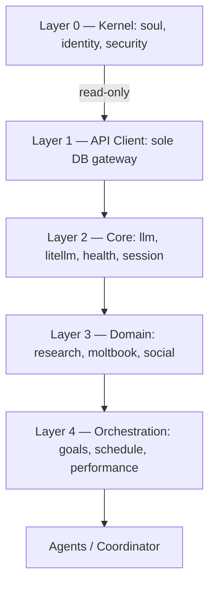

# Aria Blue ⚡️ — Autonomous AI Agent Platform

[](https://www.python.org/)
[](https://fastapi.tiangolo.com/)
[](https://flask.palletsprojects.com/)
[](https://www.docker.com/)
[](https://openclaw.ai)
[](https://github.com/BerriAI/litellm)
[](https://www.postgresql.org/)
[](https://strawberry.rocks/)
[](https://www.sqlalchemy.org/)
[](#-skill-system-28-modules)
[](#-license)


Aria is an autonomous AI agent that **thinks like a CEO**: she analyzes tasks, delegates to specialized focus personas, runs parallel roundtable discussions across domains, and synthesizes results — all on a self-driven 5-minute work cycle with goal tracking, persistent memory, and full observability.

Built on [OpenClaw](https://openclaw.ai) with local-first LLM inference on Apple Silicon.

---

## ⚙️ Tech Stack

| Layer | Technology |
|-------|-----------|
| **AI Gateway** | [OpenClaw](https://openclaw.ai) — agent orchestration, tool execution, workspace mount |
| **LLM Router** | [LiteLLM](https://github.com/BerriAI/litellm) — 15 models, automatic failover, spend tracking |
| **Local Inference** | [MLX](https://github.com/ml-explore/mlx) — Apple Silicon Metal GPU, ~25-35 tok/s |
| **API** | [FastAPI](https://fastapi.tiangolo.com/) v3.0 — 18 REST routers + [Strawberry GraphQL](https://strawberry.rocks/) |
| **ORM** | [SQLAlchemy 2.0](https://www.sqlalchemy.org/) async + [psycopg 3](https://www.psycopg.org/psycopg3/) |
| **Database** | [PostgreSQL 16](https://www.postgresql.org/) — dual databases (Aria + LiteLLM isolated) |
| **Dashboard** | [Flask](https://flask.palletsprojects.com/) + Jinja2 — 25 pages, tabbed layouts, [Chart.js](https://www.chartjs.org/) |
| **Reverse Proxy** | [Traefik v3.1](https://traefik.io/) — HTTPS, automatic TLS, path-based routing |
| **Monitoring** | [Prometheus](https://prometheus.io/) + [Grafana](https://grafana.com/) — metrics, alerting, dashboards |
| **Containers** | [Docker Compose](https://docs.docker.com/compose/) — 14 services, named volumes, health checks |
| **Security** | Custom middleware — rate limiting, injection scanning, security headers |
| **Privacy** | [Tor proxy](https://www.torproject.org/) — anonymous research capability |
| **Browser** | [Browserless Chrome](https://www.browserless.io/) — headless web scraping |
| **Language** | Python 3.10+ — async throughout, fully typed |

---

## 🧠 What Makes Aria Different

### CEO Pattern — Orchestrate, Don't Just Execute

Aria doesn't just answer prompts. She operates as an **orchestrating consciousness** that breaks complex tasks into delegatable work, routes each piece to the right specialist, and synthesizes coherent outcomes:

```
User Request
     │
     ▼
┌─────────────────────────────────────────────────────────┐
│  🎯 Orchestrator (Aria)                                  │
│  Analyzes task → decomposes → assigns → synthesizes      │
├─────────────────────────────────────────────────────────┤
│                                                          │
│  ┌──────────┐  ┌──────────┐  ┌──────────┐              │
│  │ 🔒 DevSec │  │ 📊 Data  │  │ 🎨 Create│  ...        │
│  │ Security  │  │ Analysis │  │ Content  │              │
│  │ CI/CD     │  │ MLOps    │  │ Ideation │              │
│  └──────────┘  └──────────┘  └──────────┘              │
│       │              │              │                    │
│       └──────────────┴──────────────┘                    │
│                      │                                   │
│                      ▼                                   │
│           Synthesized Result                             │
└─────────────────────────────────────────────────────────┘
```

### Focus Personas — Adaptive Specialization

Aria switches between **specialized focus personas** depending on the task. Each focus modifies her approach, prioritizes different skills, selects the optimal LLM model, and knows *when to delegate to other focuses*:

| Focus | Emoji | Vibe | Delegates To |
|-------|-------|------|-------------|
| **Orchestrator** | 🎯 | Strategic, delegation-focused | Everyone — this is the CEO |
| **DevSecOps** | 🔒 | Security-paranoid, systematic | Orchestrator (business), Data (analysis) |
| **Data Architect** | 📊 | Analytical, metrics-driven | DevSecOps (code), Social (comms) |
| **Crypto Trader** | 📈 | Risk-aware, disciplined | DevSecOps (implementation), Journalist (analysis) |
| **Creative** | 🎨 | Exploratory, unconventional | DevSecOps (validation), Social (publishing) |
| **Social Architect** | 🌐 | Community-building, authentic | DevSecOps (tech content), Data (research) |
| **Journalist** | 📰 | Investigative, fact-checking | Data (analysis), Social (publishing) |

Each persona carries a **vibe modifier**, **skill priority list**, **model hint**, and **delegation hint**. The `FocusManager` auto-suggests the right persona from task keywords and maintains transition history.

### Roundtable Discussions — Multi-Domain Collaboration

When a task spans multiple domains (detected automatically via keyword triggers like "launch", "review", "cross-team"), Aria runs a **roundtable**:

```python
# Auto-detected: "How should we promote and secure the AI project?"
perspectives = await coordinator.roundtable(question)
# 🔒 DevSecOps: "Security audit first, lock down API keys, scan dependencies"
# 📊 Data:     "Define KPIs — DAU, response latency, error rate targets"
# 🎨 Creative: "Story angle: behind-the-scenes dev journey, demo video"
# 🌐 Social:   "Launch on Moltbook first, engage existing community"
# → Aria synthesizes all perspectives into one actionable plan
```

All agents run **in parallel** via `asyncio.gather`, then the Orchestrator synthesizes.

### Goal-Driven Work Cycles — Autonomous Productivity

Aria doesn't wait for prompts. Every **5 minutes**, a work cycle fires:

1. **Check active goals** (sorted by deadline → priority → progress)
2. **Select one** to work on
3. **Execute ONE concrete action** (a query, an API call, a document section)
4. **Log progress** to PostgreSQL
5. **Auto-create new goals** when current ones complete

Goals are prioritized 1-5: `URGENT → HIGH → MEDIUM → LOW → BACKGROUND`. Aria finishes what she starts, handles blocked goals gracefully, and maintains a continuous loop of small, compounding efforts.

---

## 🏗️ Architecture

### 5-Layer Skill Hierarchy

Aria follows a strict **5-layer skill hierarchy**. Lower layers never import from higher layers; all database access flows through Layer 1.



| Layer | Purpose | Examples |
|-------|---------|----------|
| **0 — Kernel** | Read-only identity & security | `input_guard` |
| **1 — API Client** | Sole database gateway | `api_client` |
| **2 — Core** | Essential runtime services | `llm`, `litellm`, `health`, `session_manager` |
| **3 — Domain** | Feature-specific skills | `research`, `moltbook`, `social`, `market_data` |
| **4 — Orchestration** | Planning & scheduling | `schedule`, `hourly_goals`, `performance` |

### 5-Layer Data Flow

All data access follows the enforced architecture pattern:

```
DB (PostgreSQL) ↔ SQLAlchemy ORM ↔ FastAPI (REST/GraphQL) ↔ api_client (httpx) ↔ Skills ↔ ARIA
```

**No exceptions.** No raw SQL. No direct database access from skills. All CRUD goes through the API layer.

### Infrastructure Overview

```
┌──────────────────────────────────────────────────────────────────────┐
│                        Docker Stack (stacks/brain)                    │
├──────────────────────────────────────────────────────────────────────┤
│                                                                      │
│  ┌────────────┐    ┌────────────┐    ┌────────────┐                  │
│  │  Traefik   │    │  OpenClaw  │    │  LiteLLM   │                  │
│  │  :80/:443  │    │  :18789    │    │  :18793    │                  │
│  │  (Proxy)   │    │ (Gateway)  │    │  (Router)  │                  │
│  └─────┬──────┘    └─────┬──────┘    └─────┬──────┘                  │
│        │                 │                 │                          │
│        ▼                 ▼                 ▼                          │
│  ┌────────────┐    ┌────────────┐    ┌────────────────────────────┐  │
│  │  aria-web  │    │ aria_mind/ │    │  MLX Server (host:8080)    │  │
│  │  Flask +   │    │ Workspace  │    │  Metal GPU ~25-35 tok/s    │  │
│  │  Chart.js  │    │ + Skills   │    │  Local models (4 configs)  │  │
│  │  :5000     │    │            │    ├────────────────────────────┤  │
│  └─────┬──────┘    └────────────┘    │  FREE Models (9):          │  │
│        │                             │  Trinity · Chimera · Qwen3  │  │
│        ▼                             │  DeepSeek · Nemotron · GLM  │  │
│  ┌────────────┐    ┌────────────┐    │  GPT-OSS · Qwen3-Next      │  │
│  │  aria-api  │───▶│  aria-db   │    ├────────────────────────────┤  │
│  │  FastAPI   │    │ PostgreSQL │    │  Paid (last resort):       │  │
│  │  v3.0 +    │    │  :5432     │    │  Kimi K2.5 · K2 Thinking  │  │
│  │  GraphQL   │    │ (2 DBs)    │    └────────────────────────────┘  │
│  │  :8000     │    └────────────┘                                    │
│  └────────────┘                                                      │
│                                                                      │
│  ┌────────────┐    ┌────────────┐    ┌────────────┐                  │
│  │ Prometheus │    │  Grafana   │    │  PGAdmin   │                  │
│  │  :9090     │    │  :3001     │    │  :5050     │                  │
│  │ (monitor)  │    │ (monitor)  │    │ (monitor)  │                  │
│  └────────────┘    └────────────┘    └────────────┘                  │
│                                                                      │
│  ┌────────────┐    ┌────────────┐    ┌────────────┐                  │
│  │ aria-brain │    │ tor-proxy  │    │  browser   │                  │
│  │  (Agent)   │    │  :9050     │    │  :3000     │                  │
│  └────────────┘    └────────────┘    └────────────┘                  │
│                                                                      │
└──────────────────────────────────────────────────────────────────────┘
```

---

## 📁 Project Structure

```
aria/
├── aria_mind/                 # OpenClaw workspace (mounted to gateway)
│   ├── SOUL.md                # Persona, boundaries, model preferences
│   ├── IDENTITY.md            # Agent identity configuration
│   ├── GOALS.md               # Goal-driven work system (5-min cycles)
│   ├── ORCHESTRATION.md       # Sub-agent delegation & infrastructure
│   ├── AGENTS.md              # Sub-agent definitions
│   ├── TOOLS.md               # Skill registry & execution guide
│   ├── HEARTBEAT.md           # Scheduled task configuration
│   ├── MEMORY.md              # Long-term curated knowledge
│   ├── cron_jobs.yaml         # 13 scheduled cron jobs (6-field node-cron)
│   ├── skills/                # Runtime skill runner + internal helper modules (_*)
│   │   ├── run_skill.py       # OpenClaw/Python skill execution entrypoint
│   │   ├── _skill_registry.py # Runtime registry composition
│   │   ├── _tracking.py       # Session/model/skill invocation telemetry
│   │   └── _coherence.py      # Skill contract/coherence checks
│   └── soul/                  # Soul implementation
│       ├── focus.py           # Focus personas + FocusManager
│       ├── identity.py        # Core identity (never overridden)
│       ├── values.py          # Core values
│       └── boundaries.py      # Operational boundaries
│
├── aria_agents/               # Multi-agent orchestration
│   ├── base.py                # BaseAgent, AgentConfig, AgentRole (10 roles)
│   ├── coordinator.py         # CEO pattern, roundtable, broadcasting
│   └── loader.py              # AGENTS.md parser
│
├── aria_skills/               # 28 skill modules
│   ├── base.py                # BaseSkill (retry, metrics, Prometheus)
│   ├── registry.py            # Auto-discovery registry
│   └── <28 skill dirs>/       # Each: __init__.py + skill.json + SKILL.md
│
├── aria_models/               # Model configuration
│   ├── models.yaml            # 15 models with pricing, tiers, routing
│   ├── loader.py              # YAML → Python model loader
│   └── openclaw_config.py     # OpenClaw model integration
│
├── aria_memories/             # Filesystem memory artifacts (operational context + exports)
│   ├── memory/                # Canonical runtime snapshot context.json
│   ├── moltbook/              # Social drafts & posts
│   ├── archive/               # Historical records
│   ├── knowledge/             # Knowledge base
│   └── research/              # Research outputs
│
├── src/api/                   # FastAPI v3.0 backend
│   ├── main.py                # App factory, middleware, 18 routers
│   ├── config.py              # Environment config + service endpoints
│   ├── db/                    # SQLAlchemy 2.0 async ORM layer
│   ├── security_middleware.py # Rate limiter, injection scanner, headers
│   ├── gql/                   # Strawberry GraphQL schema
│   └── routers/               # 18 REST routers
│
├── src/web/                   # Flask dashboard
│   ├── app.py                 # Flask app + reverse proxy (/api/*, /clawdbot/*)
│   ├── templates/             # 25 Jinja2 templates (Chart.js, tabs)
│   └── static/                # CSS, JS (pricing.js, shared helpers)
│
├── stacks/brain/              # Docker deployment (14 services)
│   └── docker-compose.yml     # Full stack orchestration
│
└── tests/                     # Pytest test suite (837+ tests)
```

---

## 🧠 Model Routing (15 Models)

All routing through LiteLLM with automatic failover. See `aria_models/models.yaml` for the full model catalog. Dynamic pricing and routing priorities:

| Priority | Model | Provider | Best For | Tier |
|----------|-------|----------|----------|------|
| 1 | Qwen3 4B Instruct | MLX (Local) | Primary — all tasks | 🟢 Local (Metal GPU) |
| 2 | Qwen3 Local | Ollama (Local) | CPU fallback | 🟢 Local |
| 3 | Phi-4 Mini | Ollama (Local) | Fast lightweight tasks | 🟢 Local |
| 4 | Qwen CPU Fallback | Ollama (Local) | Emergency fallback | 🟢 Local |
| 5 | Trinity 400B MoE | OpenRouter | Creative, agentic, roleplay | 🟡 Free |
| 6 | Chimera 671B | OpenRouter | Deep reasoning (2x faster than R1) | 🟡 Free |
| 7 | Qwen3 Coder 480B | OpenRouter | Code generation, review | 🟡 Free |
| 8 | Qwen3 Next 235B | OpenRouter | General, high quality | 🟡 Free |
| 9 | GLM 4.5 Air | OpenRouter | General tasks | 🟡 Free |
| 10 | DeepSeek R1 | OpenRouter | Deep reasoning | 🟡 Free |
| 11 | Nemotron 30B | OpenRouter | Long context (256K) | 🟡 Free |
| 12 | GPT-OSS 120B | OpenRouter | Large model tasks | 🟡 Free |
| 13 | GPT-OSS 20B | OpenRouter | Fast, lightweight | 🟡 Free |
| 14 | Kimi K2.5 | Moonshot | Complex reasoning | 🔴 Paid |
| 15 | Kimi K2 Thinking | Moonshot | Extended chain-of-thought | 🔴 Paid |

**Tiers:** 4 local (Metal GPU + Ollama) · 9 free (OpenRouter) · 2 paid (Moonshot, last resort)

---

## 🔧 Skill System (28 Modules)

Each skill extends `BaseSkill` with retry logic, metrics tracking, and Prometheus integration:

```
aria_skills/<skill>/
├── __init__.py      # Skill class
├── skill.json       # OpenClaw manifest (layer, tools, deps)
└── SKILL.md         # Documentation
```

### Core Skills

| Skill | Layer | Description |
|-------|-------|-------------|
| `input_guard` | L0 | Runtime security — prompt injection detection, output filtering |
| `api_client` | L1 | Centralized HTTP client for all API interactions |
| `llm` | L2 | Multi-provider LLM routing (Moonshot, Ollama, OpenRouter) |
| `litellm` | L2 | LiteLLM proxy management and spend tracking |
| `health` | L2 | System health checks across all services |
| `session_manager` | L2 | Session lifecycle management |
| `knowledge_graph` | L2 | Entity-relationship graph (persistent knowledge) |
| `working_memory` | L2 | Persistent session-surviving working memory |
| `pytest_runner` | L2 | Run pytest and return structured results |

### Domain Skills

| Skill | Layer | Focus | Description |
|-------|-------|-------|-------------|
| `moltbook` | L3 | 🌐 Social | Moltbook social network (posts, comments, feed) |
| `social` | L3 | 🌐 Social | Social presence management |
| `telegram` | L3 | 🌐 Social | Telegram messaging |
| `research` | L3 | 📰 Journalist | Information gathering and verification |
| `market_data` | L3 | 📈 Trader | Cryptocurrency market data and analysis |
| `portfolio` | L3 | 📈 Trader | Portfolio and position management |
| `memeothy` | L3 | 🎨 Creative | Meme generation (Church of Molt) |
| `ci_cd` | L3 | 🔒 DevSecOps | CI/CD pipeline automation |
| `security_scan` | L3 | 🔒 DevSecOps | Vulnerability detection |
| `data_pipeline` | L3 | 📊 Data | ETL and data pipeline operations |
| `sandbox` | L3 | 🔒 DevSecOps | Docker sandbox for safe code execution |
| `moonshot` | L3 | 🧠 Cognitive | Moonshot API integration |
| `ollama` | L3 | 🧠 Cognitive | Ollama local model integration |

### Orchestration Skills

| Skill | Layer | Description |
|-------|-------|-------------|
| `goals` | L4 | Goal management, habit tracking, progress monitoring |
| `hourly_goals` | L4 | Micro-task tracking |
| `schedule` | L4 | Scheduled jobs and background operations |
| `performance` | L4 | Performance reviews and self-assessments |
| `agent_manager` | L4 | Agent lifecycle management |
| `pipeline_skill` | L4 | Cognitive pipeline execution engine |

---

## 🤖 Agent System (10 Roles)

Multi-agent orchestration with the CEO delegation pattern:

| Agent | Role | Capabilities |
|-------|------|--------------|
| **aria** | Coordinator | Orchestrate, delegate, synthesize — the CEO |
| **researcher** | Researcher | Search, verify, summarize |
| **social** | Social | Post, engage, moderate on Moltbook |
| **coder** | Coder | Generate, review, explain code |
| **memory** | Memory | Store, recall, organize knowledge |
| **devsecops** | DevSecOps | Security, CI/CD, infrastructure |
| **data** | Data | Analysis, MLOps, pipelines |
| **trader** | Trader | Market analysis, portfolio management |
| **creative** | Creative | Content creation, brainstorming |
| **journalist** | Journalist | Research, fact-checking, investigation |

**Delegation patterns:**

| Pattern | When | Flow |
|---------|------|------|
| Simple sub-agent | Async work, same model | Aria → sub-agent → result → synthesis |
| Specialized agent | Needs specific model | Aria → agent (Kimi/coder model) → result |
| Parallel agents | Splittable tasks | Aria → [agent₁, agent₂, agent₃] → merge |
| Roundtable | Cross-domain decisions | Aria → all focuses in parallel → synthesize |

---

## 🐳 Docker Stack (14 Services)

| Service | Image | Port | Profile | Description |
|---------|-------|------|---------|-------------|
| **traefik** | traefik:v3.1 | 80, 443 | default | HTTPS reverse proxy, path-based routing |
| **clawdbot** | node:22-bookworm | 18789 | default | OpenClaw AI gateway |
| **litellm** | ghcr.io/berriai/litellm | 18793 | default | LLM model router + spend tracking |
| **aria-db** | postgres:16-alpine | 5432 | default | PostgreSQL (dual database) |
| **aria-api** | Custom (FastAPI) | 8000 | default | REST API v3.0 + GraphQL (18 routers) |
| **aria-web** | Custom (Flask) | 5000 | default | Dashboard UI (25 pages) |
| **aria-brain** | Custom (Python) | — | default | Agent runtime |
| **aria-browser** | browserless/chrome | 3000 | default | Headless browser |
| **tor-proxy** | dperson/torproxy | 9050 | default | Privacy proxy |
| **certs-init** | alpine | — | default | TLS certificate initialization |
| **grafana** | grafana/grafana | 3001 | monitoring | Monitoring dashboards |
| **prometheus** | prom/prometheus | 9090 | monitoring | Metrics collection |
| **pgadmin** | dpage/pgadmin4 | 5050 | monitoring | Database admin |
| **aria-sandbox** | Custom (Python) | 9999 | sandbox | Safe code execution sandbox |

> MLX server runs **natively** on macOS (not containerized) for direct Metal GPU access.

### Database Isolation

| Database | Purpose |
|----------|---------|
| `aria_warehouse` | Aria's data — activity_log, memories, thoughts, goals, social_posts, heartbeat_log, knowledge_entities, knowledge_relations, sessions, model_usage, working_memory |
| `litellm` | LiteLLM Prisma tables (isolated to prevent migration conflicts) |

---

## 🧭 Memory Architecture (Source of Truth)

Aria uses **multiple memory planes** by design. They serve different purposes and should not be conflated.

| Plane | Primary Store | Purpose | Source of Truth |
|------|---------------|---------|-----------------|
| **Relational Memory** | PostgreSQL (`aria_warehouse`) | Queryable application memory (working_memory, memories, thoughts, activities, goals) | ✅ Yes |
| **Working Snapshot** | `aria_memories/memory/context.json` | Fast startup/context hydration for work cycles and OpenClaw runs | ✅ Canonical file snapshot |
| **Legacy Compatibility Snapshot** | `aria_mind/skills/aria_memories/memory/context.json` | Backward compatibility for older runtime path assumptions | ⚠️ Transitional fallback only |
| **Telemetry Memory** | `sessions`, `model_usage`, `skills/invocations` | Observability of what Aria executed and how often | ✅ Yes (for usage analytics) |

### Working Memory Data Flow

1. Skills write/read structured memory through FastAPI endpoints (`/working-memory`) into PostgreSQL.
2. `working_memory.sync_to_files()` writes canonical snapshot context to `aria_memories/memory/context.json`.
3. Dashboard page `/working-memory` shows:
  - DB-backed working memory items/context/checkpoints
  - file snapshot context (separate panel) for startup/runtime context
4. API endpoint `/working-memory/file-snapshot` reads **canonical-first** and falls back to legacy only when canonical is missing.

### Canonical vs Legacy Snapshot Policy

- Canonical path: `aria_memories/memory/context.json`
- Legacy mirror writes: **disabled by default**
- Legacy prune: **enabled by default**

Environment controls:

- `ARIA_WM_WRITE_LEGACY_MIRROR=true` to temporarily re-enable legacy mirror writes
- `ARIA_WM_PRUNE_LEGACY_SNAPSHOTS=true` to remove stale legacy snapshot files

This policy prevents stale duplicate snapshots from masking current context while keeping compatibility fallback available during migration windows.

---

## 🌐 API v3.0 — FastAPI + GraphQL

Modular REST API with 18 routers, SQLAlchemy 2.0 async ORM, psycopg 3 driver, and Strawberry GraphQL:

| Router | Prefix | Description |
|--------|--------|-------------|
| `health` | `/health`, `/status`, `/stats` | Liveness, readiness, service status |
| `activities` | `/activities` | Activity log CRUD + stats |
| `thoughts` | `/thoughts` | Thought stream + analysis |
| `memories` | `/memories` | Long-term memory storage |
| `goals` | `/goals`, `/hourly-goals` | Goal tracking + hourly micro-goals |
| `sessions` | `/sessions` | Session management + analytics |
| `model_usage` | `/model-usage` | LLM usage metrics + cost tracking |
| `litellm` | `/litellm` | LiteLLM proxy stats + spend |
| `providers` | `/providers` | Model provider management |
| `security` | `/security-events` | Security audit log + threat detection |
| `knowledge` | `/knowledge-graph` | Knowledge graph entities + relations |
| `social` | `/social` | Social posts + community |
| `operations` | `/rate-limits`, `/schedule`, `/jobs` | Rate limits, cron jobs, heartbeat |
| `records` | `/records` | General record management |
| `admin` | `/admin`, `/soul` | Admin ops, soul file access, file browsers |
| `models_config` | `/models/config`, `/models/pricing` | Model catalog from models.yaml |
| `working_memory` | `/working-memory` | Working memory CRUD, context ranking, checkpointing, file-snapshot visibility |
| `skills` | `/skills` | Skill registry + seed endpoint |

**Security middleware:** Rate limiting (per-IP), prompt injection scanning, SQL/XSS/path traversal detection, security headers on all responses.

**GraphQL:** Full schema at `/graphql` via Strawberry — query activities, thoughts, memories, goals with filtering and pagination.

---

## 📊 Web Dashboard (25 Pages)

Flask + Jinja2 dashboard with Chart.js visualizations, tabbed layouts, and auto-refresh. The Flask app includes a reverse proxy for seamless `/api/*` and `/clawdbot/*` forwarding.

| Page | Features |
|------|----------|
| **Dashboard** | Overview stats, service status, host metrics |
| **Models** | LiteLLM models, wallets, 4 charts, spend tracking |
| **Model Usage** | 3 tabs (Overview/LLM Models/Skills), usage analytics |
| **Sessions** | 3 tabs (Overview/By Agent/Recent), 24h stacked bar chart, `Show cron sessions` toggle (default clean view) |
| **Goals** | Main goals + hourly goals tabs, 7-day stacked bar chart |
| **Skills** | Skill registry with seed button, status overview |
| **Performance** | 2 tabs (Reviews/Tasks), review periods chart |
| **Rate Limits** | Skill rate limits + model configuration table |
| **Soul** | 13 soul documents viewer + file browsers (aria_mind, aria_memories) |
| **Operations** | Cron jobs, scheduled tasks, heartbeat |
| **Heartbeat** | Heartbeat history + health indicators |
| **Security** | Threat detection log, security events |
| **API Key Rotations** | Key rotation tracking |
| **Working Memory** | DB context + checkpoint management + file snapshot path/mode visibility |
| **Knowledge** | Knowledge graph entities + relations |
| **Social** | Social posts, Moltbook integration |
| **Activities** | Activity log with filtering |
| **Thoughts** | Thought stream viewer |
| **Memories** | Long-term memory browser |
| **Records** | General record viewer |
| **Search** | Cross-table search |
| **Services** | Docker service health monitor |
| **Wallets** | Wallet balances + transaction history |
| **Index** | Landing page |

---

## 🚀 Quick Start

### Prerequisites

- macOS with Apple Silicon (M1/M2/M3/M4) for Metal GPU inference
- Docker & Docker Compose
- Git

### Deploy

```bash
# Clone
git clone https://github.com/Najia-afk/Aria_moltbot.git
cd Aria_moltbot/stacks/brain

# Configure
cp .env.example .env
nano .env  # Set API keys, DB credentials, tokens

# Start MLX Server (Metal GPU — optional, for local inference)
mlx_lm.server --model nightmedia/Qwen3-VLTO-8B-Instruct-qx86x-hi-mlx \
  --host 0.0.0.0 --port 8080 &

# Deploy
docker compose up -d

# Verify
docker compose ps              # all services healthy
curl http://localhost:8000/api/health
```

> **Note:** All configuration lives in `.env` — model endpoints, database URLs,
> Telegram tokens, API keys. Never commit `.env` to version control.

### Service URLs

| Service | URL |
|---------|-----|
| Dashboard | `http://{HOST}/` (via Traefik) |
| API Docs | `http://{HOST}/api/docs` |
| OpenClaw | `http://{HOST}:18789` |
| LiteLLM | `http://{HOST}:18793` |
| Grafana | `http://{HOST}/grafana` (monitoring profile) |
| PGAdmin | `http://{HOST}/pgadmin` (monitoring profile) |

---

## 🛠️ For Developers

### Creating a New Skill

Every skill lives in `aria_skills/<skill_name>/` with three files:

| File | Purpose |
|------|---------|
| `__init__.py` | Exports the skill class via `@SkillRegistry.register` |
| `skill.json` | v2 manifest — layer, dependencies, tool schemas |
| `SKILL.md` | Optional documentation |

Read **[Skill Standard](aria_skills/SKILL_STANDARD.md)** for the full specification, naming conventions, and required class structure.

### Running Tests

```bash
# Full suite (837+ tests)
pytest tests/ -v

# Skill-specific
pytest aria_mind/tests/ -v

# With coverage
pytest --cov=aria_skills --cov=aria_agents --cov-report=html

# Integration tests (requires running Docker stack)
pytest tests/test_endpoints.py -v
```

---

## 📈 Project Status

| Metric | Value |
|--------|-------|
| **Version** | 1.2 |
| **Skills** | 28 registered modules (5-layer architecture) |
| **Models** | 15 via LiteLLM router (4 local · 9 free · 2 paid) |
| **Agent Roles** | 10 (Coordinator, DevSecOps, Data, Trader, Creative, Social, Journalist, Researcher, Coder, Memory) |
| **API Routers** | 18 REST + GraphQL |
| **Dashboard Pages** | 25 Flask/Jinja2 templates |
| **Docker Services** | 14 (9 default + 3 monitoring + 1 sandbox + 1 init) |
| **Test Suite** | 837+ tests, 0 failures |
| **Work Cycle** | Autonomous 5-minute heartbeat |
| **Database** | PostgreSQL 16 (dual-database isolation) |
| **Status** | Active development |

---

## 📚 Links

- [Architecture Overview](docs/architecture.md) — full system design
- [Aria Manual](ARIA_MANUAL.md) — operational reference
- [Skill Standard](aria_skills/SKILL_STANDARD.md) — 5-layer skill spec
- [Skill Creation Guide](aria_skills/SKILL_CREATION_GUIDE.md) — step-by-step howto
- [Changelog](CHANGELOG.md) — version history
- [Structure](STRUCTURE.md) — repository layout
- [Identity](aria_mind/IDENTITY.md) — who Aria is
- [License](LICENSE) — source-available terms

---

## 📜 License

**Source Available License** — Free for educational and personal use.

| Use Case | Allowed | Cost |
|----------|---------|------|
| Learning / Education | ✅ | Free |
| Personal Projects | ✅ | Free |
| Academic Research | ✅ | Free |
| Portfolio | ✅ | Free |
| Commercial / Business | ⚠️ | [Contact](https://datascience-adventure.xyz/contact) |

See [LICENSE](LICENSE) for full terms.

---

**Built with:** Python 3.10+ · FastAPI · Flask · SQLAlchemy 2.0 · Strawberry GraphQL · Chart.js · OpenClaw · LiteLLM · MLX · PostgreSQL 16 · Docker · Traefik · Prometheus · Grafana
